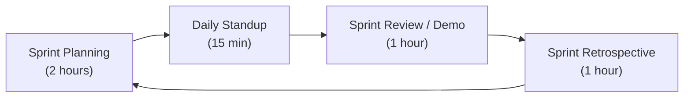
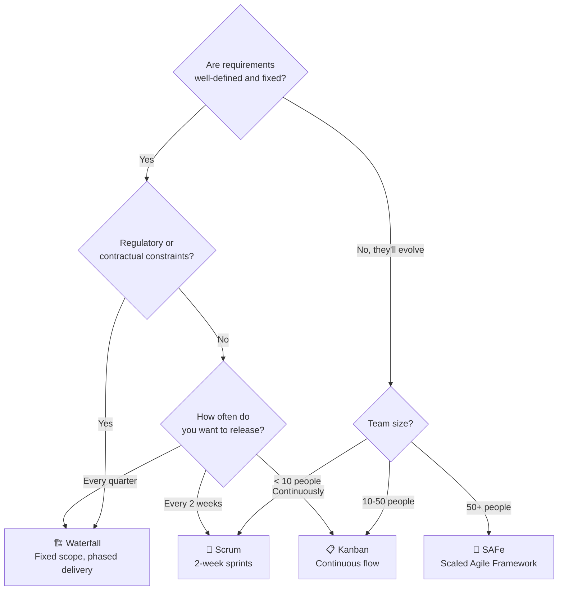

# Module 15.10: The Scrum Master

## The Role
The Scrum Master is the **facilitator and coach** for the agile development team. They do not manage people or the product — they manage the *process*. Their mission is to remove impediments and help the team perform at their highest level.

> **Industry Reality:** In mature organizations, Scrum Masters also track DORA metrics, facilitate retrospectives that lead to real change, and coach teams transitioning from Waterfall to Agile.

---

## Core Responsibilities

| Responsibility | Description | Frequency |
|---|---|---|
| Facilitate ceremonies | Standups, Sprint Planning, Retros, Demos | Per sprint |
| Remove blockers | Escalate impediments immediately | Daily |
| Protect the team | Shield from scope creep mid-sprint | Continuous |
| Track velocity | Monitor team capacity over time | Per sprint |
| Coach agile practices | Help team improve processes | Continuous |
| Monitor DORA metrics | Track delivery performance | Weekly |

---

## Scenario: AI-Powered Document Analyzer

### Sprint Ceremony Guide

Here's how the Scrum Master runs each ceremony for our project:



#### Sprint Planning (Start of Sprint)
- **Goal:** Decide what work enters this sprint
- **Scrum Master says:** "Based on our velocity of 34 points/sprint, we can take 5 stories. Let's not overcommit."
- **Output:** Sprint Goal + Sprint Backlog

#### Daily Standup (Every Day, 15 min max)
Each team member answers 3 questions:
1. What did I do yesterday?
2. What will I do today?
3. Am I blocked on anything?

- **Scrum Master says:** "The AI Engineer is blocked because they don't have API keys yet. I'll escalate to DevOps right now."

#### Sprint Review / Demo (End of Sprint)
- **Goal:** Show stakeholders what was built
- **Scrum Master says:** "We completed 4 out of 5 stories. The PDF upload feature is demo-ready."

#### Sprint Retrospective (End of Sprint)
- **Goal:** What went well? What can we improve?
- **Scrum Master says:** "Last sprint, our deployments failed 3 times. Let's add a pre-deployment checklist."

---

## Agile vs Waterfall — The Decision Tree

The Scrum Master helps the organization choose the right methodology:



### Side-by-Side Comparison

| Aspect | Scrum | Kanban | Waterfall | SAFe |
|---|---|---|---|---|
| **Cadence** | Fixed sprints (2 weeks) | Continuous flow | Phases (months) | PI cycles (8-12 weeks) |
| **Roles** | PO, SM, Dev Team | No mandatory roles | Project Manager leads | RTE, PO, SM, Architects |
| **Planning** | Sprint Planning | Just-in-time | Big upfront design | PI Planning event |
| **Changes** | Next sprint only | Anytime | Change request process | Next PI |
| **Best for** | Product teams | Support/ops teams | Construction, defense | Large enterprises |

---

## Velocity & Burndown — Tracking Progress

### Velocity Chart (Points per Sprint)

```
Sprint 1: ████████████████ 24 pts
Sprint 2: ████████████████████ 30 pts
Sprint 3: ██████████████████████████ 38 pts  ← Team is ramping up
Sprint 4: ██████████████████████████████ 34 pts  ← Stabilizing
```

**Average velocity = 31.5 points/sprint** → Use this to forecast future sprints.

### Burndown Chart Explained
- **Ideal line:** Straight diagonal from total points to zero
- **Actual line above ideal:** Team is behind schedule → Scrum Master investigates
- **Actual line below ideal:** Team is ahead → Can pull in more stories

---

## DORA Metrics — The Scrum Master's Dashboard

The Scrum Master tracks these to measure team health (see Module 15.7 for details):

| Metric | Current | Target | Status |
|---|---|---|---|
| Deployment Frequency | 1x/week | 2x/week | 🟡 Improving |
| Lead Time for Changes | 4 days | 2 days | 🟡 Improving |
| Change Failure Rate | 20% | < 15% | 🔴 Needs work |
| MTTR | 2 hours | < 1 hour | 🟢 Good |

---

## Roundtable Questions the Scrum Master Asks

- "Are there any dependencies between Frontend and Backend that might block us mid-sprint?"
- "Do we have all the API keys and staging environments ready before Sprint 1 begins?"
- "Testing Engineer — how long does your automated test suite take? If it's 30 minutes, it slows our CI/CD."
- "Product Owner — can we split this 13-point story into two smaller ones?"

---

## Your Deliverable: Sprint Plan

As a student acting as Scrum Master, create a sprint plan:

```markdown
# Sprint 1 Plan — AI Document Analyzer

## Sprint Goal
[One sentence describing the sprint goal]

## Sprint Duration
[Start Date] → [End Date] (2 weeks)

## Team Velocity (Estimated)
[X] story points

## Sprint Backlog
| Story | Points | Assignee | Status |
|---|---|---|---|
| Upload PDF | 5 | Backend Engineer | To Do |
| Show Processing UI | 3 | Frontend Engineer | To Do |
| ... | ... | ... | ... |

## Known Risks / Blockers
| Risk | Impact | Mitigation |
|---|---|---|

## Definition of Done (Team Agreement)
- [ ] Code reviewed
- [ ] Unit tests pass
- [ ] Deployed to staging
- [ ] QA verified
- [ ] PO accepted
```

> **Student Action:** Create a Sprint 1 plan with at least 4 stories. Reference the PO's backlog from Module 15.9.
