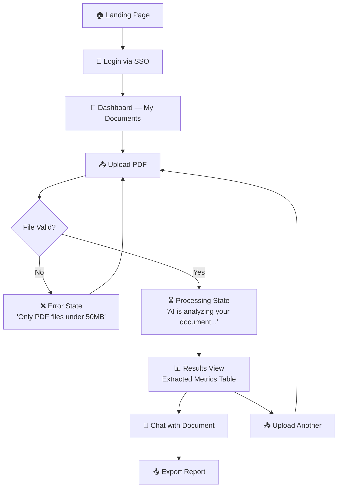
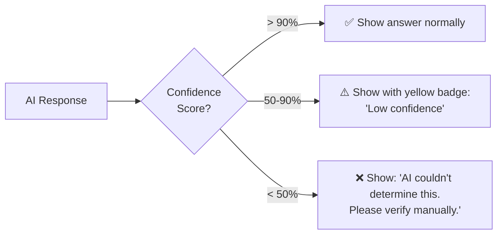
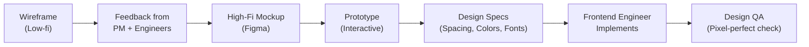

# Module 15.11: The UI/UX Designer

## The Role
The UI/UX Designer ensures the product is **intuitive, accessible, and visually delightful**. They map out the user journey, create wireframes, design high-fidelity mockups, and define interaction patterns. They are the voice of the user in every architecture discussion.

> **Industry Reality:** In AI products, the UX Designer faces a unique challenge — designing for **non-deterministic outputs**. The same prompt can produce different results, so the UI must handle uncertainty gracefully (confidence scores, loading states, error recovery).

---

## Core Responsibilities

| Responsibility | Description | Output |
|---|---|---|
| User Research | Interviews, surveys, analytics | User personas |
| Information Architecture | Content structure and navigation | Sitemap |
| Wireframing | Low-fidelity layout sketches | Wireframes |
| High-Fidelity Design | Pixel-perfect mockups | Figma / Sketch files |
| Interaction Design | Micro-animations, transitions | Prototype |
| Accessibility (a11y) | WCAG compliance | Audit checklist |
| Design System | Reusable component library | Style guide |

---

## Scenario: AI-Powered Document Analyzer

### The UX Designer's Perspective

**The core challenge:**
> "When the user uploads a 100-page PDF, the AI takes 10–30 seconds to process. They shouldn't stare at a blank screen. We need progressive disclosure — show them *something* useful while the AI works."

**The interface philosophy:**
> "The chat window needs to look familiar, like ChatGPT, so users intuitively know how to type prompts. Don't reinvent the wheel."

---

## User Flow Diagram

The UX Designer creates this flow before any code is written:



---

## Designing for AI — Unique Challenges

### The 5 States Every AI Screen Must Handle

| State | What the User Sees | Design Pattern |
|---|---|---|
| **Empty** | No documents yet | Illustration + "Upload your first document" CTA |
| **Loading** | AI is processing | Skeleton loader + progress text ("Extracting page 14 of 100...") |
| **Success** | Results are ready | Clean data table + "Chat" button |
| **Partial** | AI partially succeeded | Show results with warning: "3 metrics could not be extracted" |
| **Error** | AI failed | Clear error message + "Try again" button + support link |

### Handling AI Uncertainty



---

## Accessibility Checklist (WCAG 2.1 AA)

The UX Designer ensures the product is usable by **everyone**, including users with disabilities:

| Category | Requirement | Our Implementation |
|---|---|---|
| **Color Contrast** | 4.5:1 ratio for text | Dark text on light backgrounds, tested with tools |
| **Keyboard Navigation** | All actions via keyboard | Tab order, focus rings, skip-to-content link |
| **Screen Readers** | All elements labeled | ARIA labels on buttons, alt text on images |
| **Motion** | Respect `prefers-reduced-motion` | Disable animations for users who opt out |
| **Text Sizing** | Works at 200% zoom | Responsive layout, no fixed pixel heights |
| **Error Messages** | Descriptive, not just color | Text + icon, not just red outline |

---

## Design-to-Code Handoff Process

How the UX Designer hands designs to the Frontend Engineer:



### The Spec Sheet

| Token | Value | Usage |
|---|---|---|
| Primary Color | `#2563EB` | CTA buttons, links |
| Error Color | `#DC2626` | Error text, error borders |
| Font Family | `Inter, sans-serif` | All text |
| Border Radius | `8px` | Cards, buttons |
| Spacing Unit | `8px` | Margins, paddings (multiples of 8) |

---

## Roundtable Questions the UX Designer Asks

- "Frontend Engineer — can we support streaming text so the AI's response types out in real-time?"
- "AI Engineer — what happens if the AI hallucinates? How do we visually represent a 'low confidence' answer?"
- "Product Manager — do we have data on what our users' screen sizes are? Mobile-first or desktop-first?"
- "Accessibility — do we have any enterprise clients who require WCAG AAA compliance?"

---

## Your Deliverable: User Flow + UI Spec

As a student acting as UX Designer, create:

```markdown
# UI/UX Specification — AI Document Analyzer

## 1. User Flow Diagram
[Mermaid diagram of the complete user flow]

## 2. The 5 States
For the "Document Results" screen, design all 5 states:
| State | Description | Key UI Elements |
|---|---|---|

## 3. Design Tokens
| Token | Value |
|---|---|

## 4. Accessibility Checklist
- [ ] Color contrast tested
- [ ] Keyboard navigation works
- [ ] Screen reader labels added
- [ ] Responsive at 200% zoom

## 5. Handoff Notes for Frontend Engineer
[Specific instructions for the engineer implementing your designs]
```

> **Student Action:** Create the user flow diagram and design the 5 states for the Results screen. The Frontend Engineer (15.14) will use this spec to build the UI.
