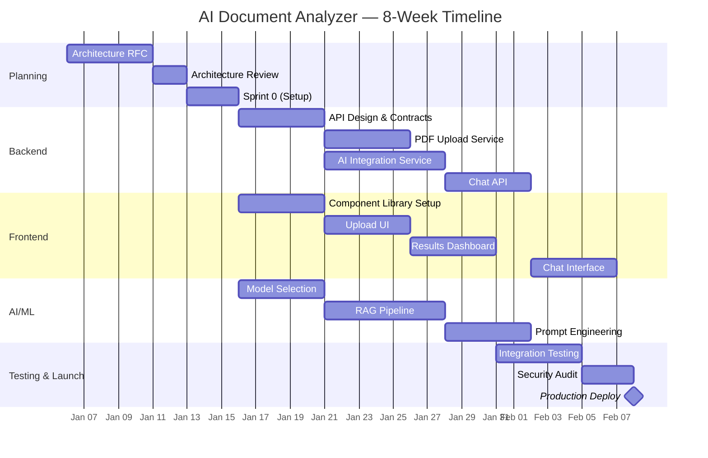
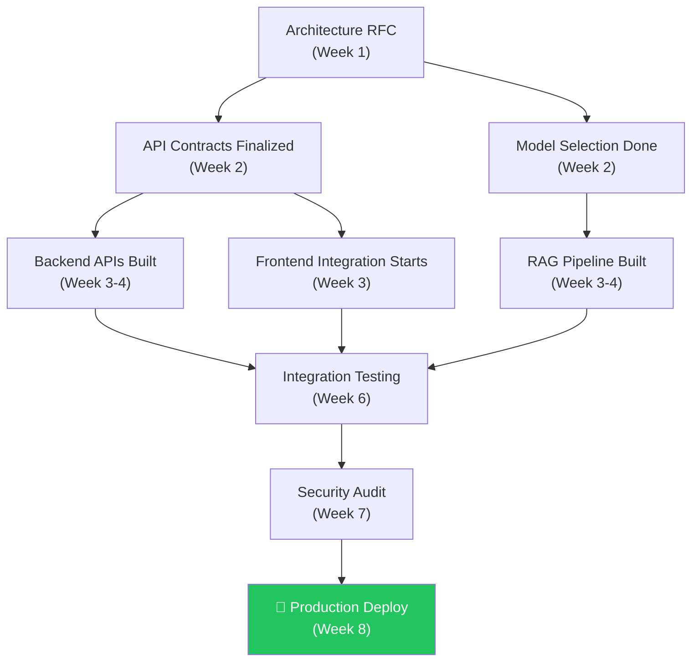

# Module 15.12: The Project Manager

## The Role
While the Product Manager defines *what* gets built, the Project Manager focuses on *how* it gets delivered — on time, within budget, and with managed risks. They coordinate resources, timelines, and cross-team dependencies.

> **Industry Reality:** In Agile environments, the Project Manager role often overlaps with the Scrum Master. In larger enterprises (especially those using SAFe), they remain distinct — the Project Manager handles program-level coordination across multiple teams.

---

## Core Responsibilities

| Responsibility | Description | Output |
|---|---|---|
| Timeline management | Create and track project schedule | Gantt chart |
| Resource allocation | Assign people to tasks | Resource matrix |
| Risk management | Identify and mitigate risks | Risk register |
| Dependency tracking | Cross-team coordination | Dependency map |
| Budget management | Track spending vs. budget | Cost report |
| Status reporting | Weekly updates to stakeholders | Status report |
| RACI management | Clarify who does what | RACI matrix |

---

## Scenario: AI-Powered Document Analyzer

### The Project Manager's Perspective

**Timeline:**
> "We have 8 weeks until launch. Backend APIs must be ready by week 3 so Frontend can start integration. The AI model selection must be finalized by week 1."

**Resource risk:**
> "The AI Engineer is taking PTO in week 4. We need to front-load the model selection and prompt engineering work."

---

## Project Timeline — Gantt Chart



---

## RACI Matrix — Who Does What?

**R** = Responsible (does the work), **A** = Accountable (owns the outcome), **C** = Consulted, **I** = Informed

| Task | PM | PO | Backend | Frontend | AI Eng | DevOps | Security | QA |
|---|---|---|---|---|---|---|---|---|
| Architecture RFC | I | C | **R/A** | C | C | C | C | I |
| Sprint Planning | I | **A** | R | R | R | I | I | I |
| API Development | I | A | **R** | C | C | I | C | I |
| UI Development | I | A | C | **R** | I | I | I | I |
| Model Selection | I | C | C | I | **R/A** | I | C | I |
| CI/CD Pipeline | C | I | C | I | I | **R/A** | C | I |
| Security Audit | I | I | C | C | C | C | **R/A** | I |
| Go/No-Go Decision | **A** | C | C | C | C | C | C | C |

---

## Risk Register

| # | Risk | Probability | Impact | Mitigation | Owner |
|---|---|---|---|---|---|
| R1 | AI model accuracy below 90% | Medium | High | Evaluate 3 models in week 1, have fallback | AI Engineer |
| R2 | OpenAI API rate limits hit during launch | High | High | Implement queue + retry logic | Backend Engineer |
| R3 | AI Engineer PTO in week 4 | Certain | Medium | Front-load AI work in weeks 1-3 | Project Manager |
| R4 | 50MB file uploads cause timeouts | Medium | Medium | Use chunked upload with presigned URLs | Backend Engineer |
| R5 | GDPR compliance gaps found late | Low | Critical | Involve Risk Officer from day 1 | Risk Officer |

---

## Dependency Map



---

## DORA Metrics — The Project Manager's Responsibility

The Project Manager tracks DORA at the program level:

| Metric | Sprint 1 | Sprint 2 | Sprint 3 | Target |
|---|---|---|---|---|
| Deployment Frequency | 0 (setup) | 1x/week | 2x/week | 2x/week |
| Lead Time | N/A | 5 days | 3 days | < 2 days |
| Change Failure Rate | N/A | 25% | 15% | < 15% |
| MTTR | N/A | 4 hours | 1 hour | < 1 hour |

---

## Roundtable Questions the Project Manager Asks

- "Are there any external vendors or APIs we need to procure before development starts?"
- "If the document parsing takes longer than expected, what is our fallback plan?"
- "AI Engineer — will you be done with model selection by end of week 1? Frontend is blocked on this."
- "DevOps — can you have the staging environment ready by day 3 of Sprint 1?"

---

## Your Deliverable: Project Plan

As a student acting as Project Manager, create a project plan:

```markdown
# Project Plan — AI Document Analyzer

## 1. Timeline (Gantt Chart)
[Mermaid Gantt chart — adjust dates to your schedule]

## 2. RACI Matrix
| Task | [Role 1] | [Role 2] | ... |
|---|---|---|---|

## 3. Risk Register
| Risk | Probability | Impact | Mitigation | Owner |
|---|---|---|---|---|

## 4. Dependencies
[Mermaid diagram showing critical path]

## 5. DORA Targets
| Metric | Target |
|---|---|

## 6. Status Report Template
- Sprint: [#]
- Progress: [X/Y stories done]
- Blockers: [List]
- Risks: [List]
```

> **Student Action:** Build a Gantt chart and risk register for the Document Analyzer. Identify the **critical path** — the longest chain of dependent tasks.
