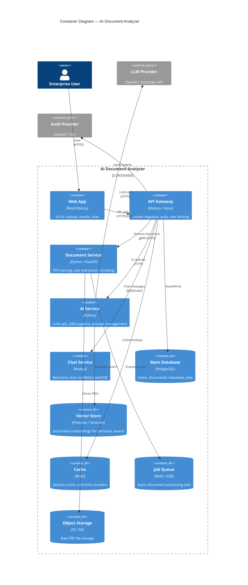

# Module 15.13: The Lead Backend Engineer

## The Role
The Lead Backend Engineer architects the **server-side logic, APIs, and system integration**. They ensure the system is scalable, robust, and performant. They make the critical "How do we build this?" decisions.

> **Industry Reality:** The Lead Backend Engineer often writes the RFC/design doc. They own the C4 Container Diagram, API contracts, and make the Microservices vs Monolith decision. They are the technical anchor of the project.

---

## Core Responsibilities

| Responsibility | Description | Output |
|---|---|---|
| System architecture | Microservices vs Monolith decision | Architecture diagram |
| API design | REST / GraphQL / gRPC contracts | OpenAPI spec |
| Database integration | Work with Data Architect on queries | Data access layer |
| Performance | Caching, connection pooling, async processing | Performance budget |
| Code quality | Code reviews, standards, patterns | Style guide |
| Technical mentorship | Guide junior engineers | PR reviews |

---

## Scenario: AI-Powered Document Analyzer

### The Backend Engineer's Perspective

**Architecture decision:**
> "Instead of a monolith, let's create a dedicated microservice for document processing — it's CPU/GPU intensive and needs independent scaling. The main API gateway stays lightweight."

**API design:**
> "Document processing is async. When the user uploads a PDF, we return a `job_id`. The frontend polls `/jobs/{id}/status` until processing completes."

---

## C4 Container Diagram — The Backend Architecture

This is the diagram the Backend Engineer owns:



---

## Microservices vs Monolith — Decision Matrix

| Factor | Monolith | Microservices | Our Decision |
|---|---|---|---|
| **Team size** | 1–5 developers | 5+ developers per service | Microservices (we have 3 teams) |
| **Complexity** | Simple, single codebase | Complex, distributed | Accept complexity for scale |
| **Deployment** | Deploy everything together | Deploy independently | Independent (AI service deploys separately) |
| **Scaling** | Scale the whole app | Scale individual services | Scale doc processing independently |
| **Debugging** | Easy (single process) | Hard (distributed tracing needed) | Use Datadog for tracing |
| **Data consistency** | Easy (single DB) | Hard (eventual consistency) | Accept eventual consistency for async jobs |
| **Best for** | MVPs, small teams, simple domains | High traffic, multiple teams, complex domains | ✅ Our choice |

---

## API Contract — OpenAPI Example

The Backend Engineer publishes API contracts so Frontend can start work immediately:

```yaml
# POST /api/v1/documents/upload
paths:
  /api/v1/documents/upload:
    post:
      summary: Upload a PDF document for analysis
      requestBody:
        content:
          multipart/form-data:
            schema:
              type: object
              properties:
                file:
                  type: string
                  format: binary
                  description: PDF file (max 50MB)
      responses:
        '202':
          description: Document accepted for processing
          content:
            application/json:
              schema:
                type: object
                properties:
                  job_id:
                    type: string
                    example: "job_abc123"
                  status:
                    type: string
                    example: "PROCESSING"
                  estimated_time_seconds:
                    type: integer
                    example: 15
        '400':
          description: Invalid file type or size exceeded
        '401':
          description: Unauthorized

  /api/v1/jobs/{jobId}/status:
    get:
      summary: Check processing status
      responses:
        '200':
          content:
            application/json:
              schema:
                type: object
                properties:
                  status:
                    type: string
                    enum: [QUEUED, PROCESSING, COMPLETED, FAILED]
                  progress_percent:
                    type: integer
                  result:
                    type: object
                    description: Extracted metrics (only when COMPLETED)
```

---

## Database Selection Guide

| Database Type | When to Use | Our Usage |
|---|---|---|
| **PostgreSQL** | Structured data, ACID transactions | Users, documents metadata, jobs |
| **Redis** | Caching, rate limiting, queues | Session cache, job queue |
| **Pinecone / Vectorize** | Semantic similarity search | Document embeddings for RAG |
| **S3 / R2** | Large binary file storage | Raw PDF files |

---

## Roundtable Questions the Backend Engineer Asks

- "AI Engineer — what language are your models wrapped in? If Python, I'll build the processing service in FastAPI."
- "Frontend Engineer — do you prefer WebSockets or Server-Sent Events (SSE) for streaming AI responses?"
- "DevOps — can you set up auto-scaling for the document processing service based on queue depth?"
- "Security Engineer — how should we sanitize uploaded PDFs to prevent malicious embedded scripts?"

---

## Your Deliverable: Backend Architecture Document

```markdown
# Backend Architecture — AI Document Analyzer

## 1. C4 Container Diagram
[Mermaid C4 Container diagram]

## 2. Architecture Decision
| Decision | Choice | Reasoning |
|---|---|---|
| Monolith vs Microservices | ? | ? |
| API Protocol | REST / GraphQL / gRPC | ? |
| Async Processing | Queue-based / Sync | ? |

## 3. API Contracts (Top 3 Endpoints)
[OpenAPI-style specs for your most important endpoints]

## 4. Database Selection
| Data | Database | Reasoning |
|---|---|---|

## 5. Non-Functional Requirements
| Requirement | Target |
|---|---|
| Response time (P95) | < 200ms (API), < 30s (AI processing) |
| Throughput | 100 concurrent uploads |
| Availability | 99.9% uptime |
```

> **Student Action:** Create the container diagram and API contracts. The Frontend Engineer (15.14) will code against your API spec.
