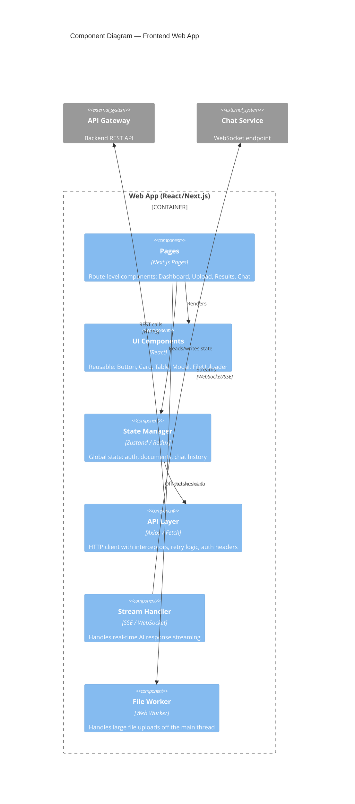
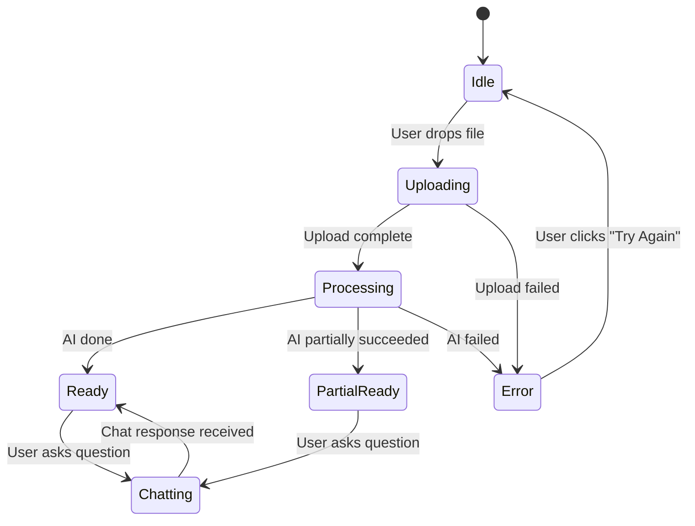

# Module 15.14: The Lead Frontend Engineer

## The Role
The Lead Frontend Engineer owns the **client-side architecture**. They translate UX designs into functional, performant, accessible code. They make critical decisions about frameworks, state management, and how the UI communicates with backend APIs.

> **Industry Reality:** In AI products, the Frontend Engineer must handle non-deterministic UX — streaming text, variable response times, confidence indicators, and graceful fallbacks when the AI fails.

---

## Core Responsibilities

| Responsibility | Description | Output |
|---|---|---|
| Frontend architecture | Framework selection, folder structure | Architecture doc |
| Component system | Reusable, tested UI components | Component library |
| State management | Global state, server state, form state | State architecture |
| Performance | Bundle size, lazy loading, caching | Performance budget |
| API integration | Consume backend APIs | API layer / hooks |
| Accessibility | Implement WCAG from UX specs | a11y audit |

---

## Scenario: AI-Powered Document Analyzer

### The Frontend Engineer's Perspective

**Performance concern:**
> "Uploading a 50MB PDF in the browser can freeze the UI if not handled in a Web Worker. We need chunked uploads with progress tracking."

**State management:**
> "We need a robust state machine for document lifecycle: `IDLE → UPLOADING → PROCESSING → READY → ERROR`. Each state drives different UI."

---

## C4 Component Diagram — Frontend Architecture



---

## State Machine — Document Lifecycle



### State-to-UI Mapping

| State | UI Elements Shown | Loading? | Actions Available |
|---|---|---|---|
| `Idle` | Upload dropzone, recent docs list | No | Upload, view history |
| `Uploading` | Progress bar (45%), file name | Yes | Cancel upload |
| `Processing` | Skeleton loader, "Analyzing page 14/100..." | Yes | None (wait) |
| `Ready` | Metrics table, summary, chat button | No | Chat, export, delete |
| `PartialReady` | Metrics table with warnings | No | Chat, retry failed metrics |
| `Error` | Error message, retry button | No | Retry, upload new |

---

## Performance Budget

| Metric | Target | How to Achieve |
|---|---|---|
| First Contentful Paint (FCP) | < 1.5s | SSR with Next.js, critical CSS inline |
| Largest Contentful Paint (LCP) | < 2.5s | Lazy load below-fold components |
| Total Bundle Size | < 250KB (gzipped) | Tree shaking, code splitting per route |
| Time to Interactive (TTI) | < 3s | Defer non-critical JS |
| File Upload (50MB) | No UI freeze | Web Worker for upload, chunked transfer |

---

## Technology Decision Matrix

| Decision | Option A | Option B | Our Choice | Reasoning |
|---|---|---|---|---|
| Framework | React + Next.js | Vue + Nuxt | Next.js | SSR for SEO, team expertise |
| State Management | Redux Toolkit | Zustand | Zustand | Simpler API, less boilerplate |
| Server State | React Query | SWR | React Query | Better caching, mutations |
| Styling | Tailwind CSS | CSS Modules | Tailwind | Rapid prototyping |
| Streaming | WebSocket | SSE | SSE | Simpler for one-way AI streaming |

---

## Roundtable Questions the Frontend Engineer Asks

- "UX Designer — can we use system fonts instead of custom web fonts to improve rendering speed?"
- "Backend Engineer — can your API support Server-Sent Events (SSE) so we can stream AI text directly to the UI?"
- "AI Engineer — what's the maximum response length? I need to set up virtual scrolling if it's > 10,000 tokens."
- "DevOps — can we serve static assets from a CDN edge for sub-100ms TTFB globally?"

---

## Your Deliverable: Frontend Architecture Document

```markdown
# Frontend Architecture — AI Document Analyzer

## 1. Component Diagram
[Mermaid C4 Component diagram]

## 2. State Machine
[Mermaid state diagram for document lifecycle]

## 3. Technology Choices
| Decision | Choice | Reasoning |
|---|---|---|

## 4. Performance Budget
| Metric | Target |
|---|---|

## 5. Key Components
| Component | Purpose | Props / State |
|---|---|---|

## 6. API Integration Plan
| Endpoint | Method | Frontend Hook | Caching Strategy |
|---|---|---|---|
```

> **Student Action:** Create the component diagram and state machine. Show how each state maps to a different UI. The UX Designer's spec (15.11) drives your implementation.
