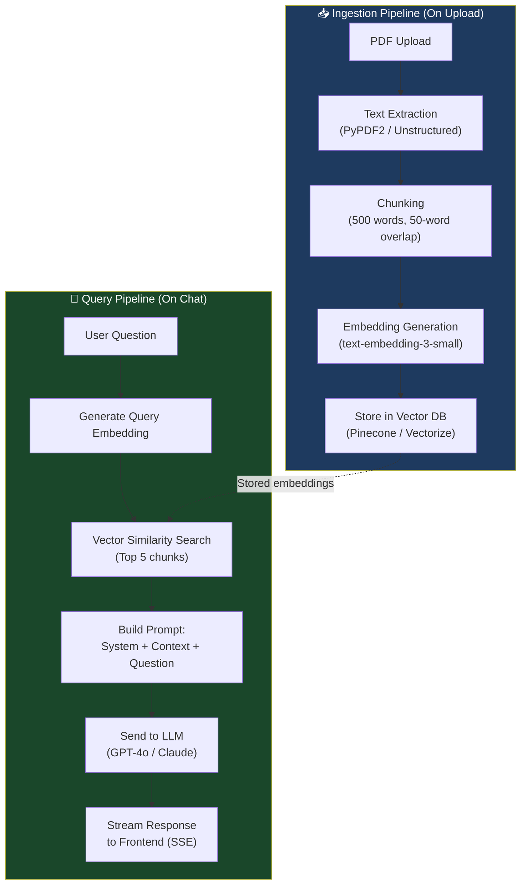

# Module 15.15: The AI/ML Engineer

## The Role
The AI/ML Engineer focuses on **implementing, integrating, and optimizing** the AI models that power the product. They bridge the gap between data science research and production software engineering. They own prompt engineering, RAG pipelines, and model evaluation.

> **Industry Reality:** The AI/ML Engineer is the most critical role in AI products. They must balance model accuracy vs. cost vs. latency — a triangle that always has trade-offs. Choosing the wrong model or architecture can make or break the product.

---

## Core Responsibilities

| Responsibility | Description | Output |
|---|---|---|
| Model selection | Evaluate and choose LLMs | Model comparison matrix |
| Prompt engineering | Design, test, version prompts | Prompt library |
| RAG architecture | Build retrieval-augmented generation pipeline | RAG pipeline design |
| Evaluation | Measure accuracy, latency, cost | Eval dashboard |
| Integration | Connect models to backend APIs | AI service |
| Cost optimization | Reduce token usage, caching | Cost analysis |

---

## Scenario: AI-Powered Document Analyzer

### The AI/ML Engineer's Perspective

**The core challenge:**
> "A 100-page PDF has ~50,000 words. That's ~65,000 tokens. Most LLMs have a 128K context window, but sending the entire document in one prompt is expensive ($0.50+ per call). We need RAG."

**The solution:**
> "Chunk the document into 500-word segments, generate embeddings, store them in a vector DB. When the user asks a question, retrieve only the 5 most relevant chunks and send those to the LLM."

---

## RAG Pipeline Architecture



---

## Model Selection Matrix

| Model | Accuracy | Latency | Cost (per 1K tokens) | Context Window | Best For |
|---|---|---|---|---|---|
| **GPT-4o** | Very High | ~2s | $0.005 input / $0.015 output | 128K | Complex reasoning, summaries |
| **GPT-4o-mini** | High | ~1s | $0.00015 / $0.0006 | 128K | Simple extraction, classification |
| **Claude 3.5 Sonnet** | Very High | ~2s | $0.003 / $0.015 | 200K | Long documents, nuanced analysis |
| **Llama 3.1 70B** | High | ~3s (self-hosted) | $0 (self-hosted) + GPU cost | 128K | Data sovereignty, no vendor lock-in |
| **Mistral Large** | High | ~2s | $0.002 / $0.006 | 128K | EU data residency |

### Our Decision for Document Analyzer

| Task | Model | Reasoning |
|---|---|---|
| Text extraction & metrics | GPT-4o-mini | Fast, cheap, structured output |
| Document summarization | GPT-4o | Needs reasoning for long docs |
| Chat with document | Claude 3.5 Sonnet | 200K context, great at RAG |
| Document classification | Custom fine-tune | Cheaper long-term, 100x cheaper per call |

---

## Prompt Engineering — The Deliverable

### Example: Metric Extraction Prompt

```
SYSTEM: You are a financial document analyst. Extract key financial metrics 
from the provided document chunks. Return data in the exact JSON format below.
Do NOT hallucinate values. If a metric cannot be found, set it to null.

OUTPUT FORMAT:
{
  "total_revenue": { "value": number | null, "currency": "USD", "confidence": 0.0-1.0, "source_page": number },
  "net_profit": { "value": number | null, "currency": "USD", "confidence": 0.0-1.0, "source_page": number },
  "operating_expenses": { "value": number | null, "currency": "USD", "confidence": 0.0-1.0, "source_page": number }
}

DOCUMENT CHUNKS:
{chunks}

IMPORTANT RULES:
1. Only extract values explicitly stated in the document
2. Include the page number where you found each value
3. Set confidence to 0.0 if you're guessing
```

### Prompt Versioning

| Version | Change | Accuracy | Cost/Call |
|---|---|---|---|
| v1.0 | Basic extraction prompt | 78% | $0.02 |
| v1.1 | Added JSON format enforcement | 85% | $0.02 |
| v1.2 | Added "Do NOT hallucinate" rule | 91% | $0.02 |
| v1.3 | Added confidence scores + source pages | 93% | $0.03 |

---

## Evaluation Framework

### How to Measure AI Quality

| Metric | What It Measures | Target | Tool |
|---|---|---|---|
| **Accuracy** | % of correctly extracted values | > 90% | Custom eval suite |
| **Hallucination Rate** | % of made-up values | < 5% | Human review + automated checks |
| **Latency (P95)** | Time to generate response | < 5s for chat, < 30s for full extraction | APM monitoring |
| **Cost per Document** | Total API cost per PDF processed | < $0.10 | Token usage tracking |
| **User Satisfaction** | Thumbs up/down on AI responses | > 80% positive | In-app feedback |

---

## Chunking Strategies — Trade-offs

| Strategy | Chunk Size | Overlap | Pros | Cons |
|---|---|---|---|---|
| Fixed-size | 500 words | 50 words | Simple, predictable | May split sentences |
| Sentence-based | 5–10 sentences | 1 sentence | Preserves meaning | Variable size |
| Paragraph-based | 1–3 paragraphs | 0 | Natural boundaries | Can be too large |
| Semantic | By topic | None | Best retrieval accuracy | Requires ML model to chunk |

---

## Roundtable Questions the AI/ML Engineer Asks

- "Product Manager — what is an acceptable error rate? 100% accuracy is mathematically impossible with LLMs."
- "Backend Engineer — how are you handling rate limits when making concurrent calls to the OpenAI API?"
- "Security Engineer — are we allowed to send customer documents to OpenAI? What about data residency?"
- "Data Architect — where are we storing the embedding vectors? Pinecone or a self-hosted solution?"

---

## Your Deliverable: AI Architecture Document

```markdown
# AI Architecture — Document Analyzer

## 1. RAG Pipeline Diagram
[Mermaid flowchart of ingestion + query pipeline]

## 2. Model Selection
| Task | Model | Reasoning |
|---|---|---|

## 3. Prompt Library
### Prompt: [Task Name]
- System prompt: [...]
- User prompt template: [...]
- Expected output format: [...]
- Version: [...]

## 4. Evaluation Plan
| Metric | Target | How to Measure |
|---|---|---|

## 5. Cost Estimate
| Task | Model | Estimated Calls/Day | Cost/Day |
|---|---|---|---|

## 6. Chunking Strategy
| Strategy | Chunk Size | Overlap | Reasoning |
|---|---|---|---|
```

> **Student Action:** Design the RAG pipeline, select models for each task, and write at least one production-ready prompt with versioning. The Backend Engineer (15.13) will wrap your AI service in an API.
