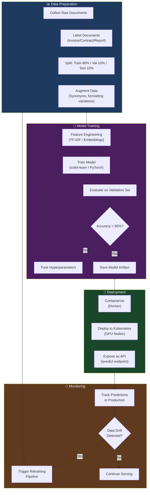

# Module 15.16: The Machine Learning (ML) Engineer

## The Role
While the AI Engineer integrates third-party LLMs and builds RAG pipelines, the ML Engineer focuses on **building, training, deploying, and monitoring custom models** from scratch. They own the MLOps lifecycle — from data preparation to model serving in production.

> **Industry Reality:** In some companies, AI Engineer and ML Engineer are the same role. In larger organizations, they are separate: the AI Engineer handles LLM integration (API calls, prompts), while the ML Engineer handles custom model training and deployment.

---

## Core Responsibilities

| Responsibility | Description | Output |
|---|---|---|
| Data preparation | Clean, label, augment training data | Training dataset |
| Model training | Train and fine-tune custom models | Trained model artifacts |
| Model evaluation | A/B testing, offline evaluation | Eval metrics |
| MLOps pipeline | Automated training → deploy pipeline | CI/CD for ML |
| Model serving | Deploy models for inference | Model API |
| Model monitoring | Detect drift, degradation | Monitoring dashboard |

---

## Scenario: AI-Powered Document Analyzer

### The ML Engineer's Perspective

**Custom model use case:**
> "Instead of paying OpenAI to classify document types (Invoice vs. Contract vs. Report), let's train a lightweight custom classifier. It runs at 100x lower cost and 10x lower latency."

**MLOps concern:**
> "Our custom classifier was 95% accurate at launch. Three months later, users are uploading documents in new formats we didn't train on. Accuracy dropped to 82%. We need automated retraining."

---

## MLOps Lifecycle Pipeline



---

## Custom Model vs. LLM API — Decision Matrix

| Factor | Custom Model | LLM API (OpenAI/Claude) | Our Decision |
|---|---|---|---|
| **Cost per prediction** | ~$0.0001 (self-hosted) | ~$0.01–0.05 | Custom for classification |
| **Latency** | 5–50ms | 500ms–3s | Custom for real-time |
| **Accuracy** | Depends on data quality | Generally very high | LLM for reasoning tasks |
| **Setup time** | Weeks (data + training) | Hours (prompt engineering) | LLM for MVP, Custom for V2 |
| **Maintenance** | Ongoing (retraining) | None (vendor handles) | Trade-off accepted |
| **Data privacy** | Data stays on your servers | Data sent to third party | Custom for sensitive data |
| **Flexibility** | Only does what it's trained for | General-purpose | LLM for open-ended tasks |

### Our Document Analyzer Strategy

| Task | Approach | Model | Reasoning |
|---|---|---|---|
| Document classification | Custom ML | Fine-tuned DistilBERT | High volume, low cost, fast |
| Text extraction | LLM API | GPT-4o-mini | Needs language understanding |
| Summarization | LLM API | GPT-4o | Complex reasoning required |
| Chat | LLM API | Claude 3.5 Sonnet | Long context, nuanced answers |

---

## Model Monitoring — Detecting Drift

### What is Data Drift?
When the real-world data starts looking different from the training data:

```
Training Data (Jan):  80% Invoices, 15% Contracts, 5% Reports
Production Data (Jun): 40% Invoices, 30% Contracts, 25% Reports, 5% UNKNOWN

⚠️ Drift detected! The model has never seen "Proposal" documents.
   Accuracy dropped from 95% → 82%.
```

### Monitoring Dashboard Metrics

| Metric | Description | Alert Threshold |
|---|---|---|
| Prediction Confidence | Average confidence score | < 85% → investigate |
| Class Distribution | % of each document type | Shift > 10% → retrain |
| Error Rate | % of incorrect predictions (from user feedback) | > 10% → retrain |
| Inference Latency | Time per prediction | > 100ms → optimize |

---

## Model Versioning

| Version | Date | Accuracy | Training Data Size | Changes |
|---|---|---|---|---|
| v1.0 | Jan 2025 | 92% | 5,000 docs | Initial release (3 classes) |
| v1.1 | Mar 2025 | 95% | 8,000 docs | Added data augmentation |
| v2.0 | Jun 2025 | 96% | 12,000 docs | Added 2 new classes (Proposal, Memo) |
| v2.1 | Sep 2025 | 97% | 15,000 docs | Fine-tuned on user-corrected predictions |

---

## Roundtable Questions the ML Engineer Asks

- "Data Architect — where are we storing user feedback? I need it to retrain the classification model."
- "DevOps Engineer — can we set up auto-scaling for the GPU instances based on queue length?"
- "Product Manager — how many document types do we need to support? Each new type needs training data."
- "Security Engineer — can I pull production documents for retraining, or is that a compliance issue?"

---

## Your Deliverable: MLOps Architecture Document

```markdown
# MLOps Architecture — Document Analyzer

## 1. MLOps Pipeline Diagram
[Mermaid flowchart: data → train → deploy → monitor → retrain]

## 2. Model Inventory
| Model | Task | Type | Accuracy | Status |
|---|---|---|---|---|

## 3. Custom vs. LLM Decision
| Task | Approach | Reasoning |
|---|---|---|

## 4. Monitoring Plan
| Metric | Threshold | Action |
|---|---|---|

## 5. Retraining Strategy
- Trigger: [What causes retraining?]
- Frequency: [How often?]
- Data source: [Where does new training data come from?]
- Rollback plan: [What if the new model is worse?]
```

> **Student Action:** Design the MLOps pipeline and decide which tasks use custom models vs. LLM APIs. The DevOps Engineer (15.20) will help you deploy your model containers.
