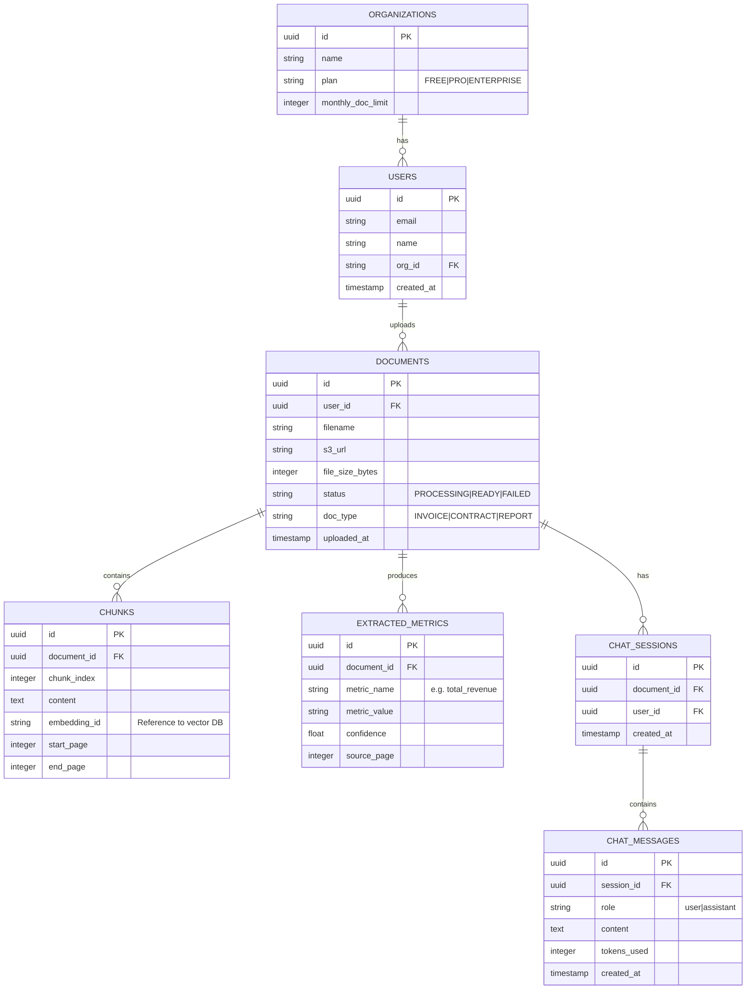
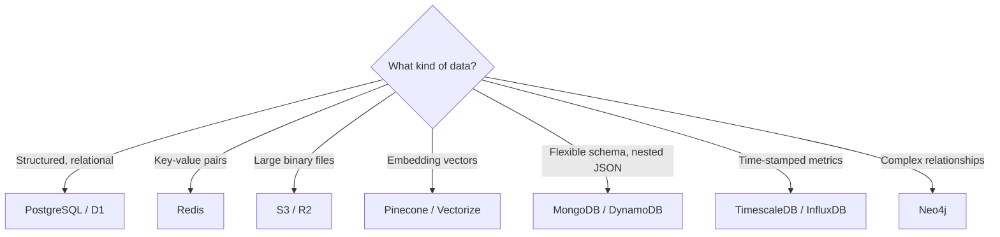

# Module 15.18: The Data Architect

## The Role
The Data Architect designs the **blueprint for how all data is stored, organized, accessed, and governed** across the system. They choose databases, design schemas, build data pipelines, and ensure the data layer is scalable, secure, and optimized.

> **Industry Reality:** In modern AI products, the Data Architect must handle traditional relational data AND new paradigms: vector databases for embeddings, object stores for files, and data lakes with the **Medallion Architecture** for analytics.

---

## Core Responsibilities

| Responsibility | Description | Output |
|---|---|---|
| Database selection | Choose the right DB for each use case | Selection matrix |
| Schema design | Design tables, indexes, relationships | ER diagrams |
| Data modeling | Define entities, attributes, relationships | Data model |
| Data pipelines | ETL/ELT for analytics and ML training | Pipeline design |
| Data governance | Retention, access control, quality | Governance policy |
| Medallion architecture | Bronze → Silver → Gold data layers | Lakehouse design |

---

## Scenario: AI-Powered Document Analyzer

### The Data Architect's Perspective

**Storage strategy:**
> "We shouldn't store raw 50MB PDFs in PostgreSQL. Put PDFs in S3/R2 and store the S3 URL in the database. Different data types need different storage engines."

**Vector storage:**
> "For the chat feature, we need a vector database to store document embeddings for fast semantic search. The AI Engineer chunks the document; I store the embeddings."

---

## Entity-Relationship Diagram



---

## Database Selection — When to Use What

| Database Type | Technology | When to Use | Our Usage | Strengths | Weaknesses |
|---|---|---|---|---|---|
| **Relational (SQL)** | PostgreSQL / D1 | Structured data, transactions, joins | Users, documents, metrics | ACID, powerful queries | Hard to scale horizontally |
| **Document (NoSQL)** | MongoDB / DynamoDB | Flexible schema, nested data | Chat history (alternative) | Schema flexibility | No joins, eventual consistency |
| **Key-Value** | Redis | Caching, sessions, counters | Rate limits, session cache | Ultra-fast, simple | No complex queries |
| **Vector** | Pinecone / Vectorize | Semantic similarity search | Document embeddings for RAG | Fast similarity search | Specialized, limited queries |
| **Object Storage** | S3 / R2 | Large binary files | Raw PDF files | Cheap, durable, scalable | No querying file contents |
| **Graph** | Neo4j | Relationships between entities | — (not needed here) | Relationship traversal | Niche use case |
| **Time-Series** | InfluxDB / TimescaleDB | Metrics over time | System monitoring data | Optimized for time queries | Limited general use |

### Decision Flowchart



---

## Medallion Architecture — Bronze, Silver, Gold

The **Medallion Architecture** is a data design pattern used in data lakehouses (Databricks, Snowflake, etc.) to progressively refine raw data into clean, analytics-ready data.

```mermaid
flowchart LR
    subgraph Bronze["🥉 Bronze Layer\n(Raw Data)"]
        B1["Raw PDF metadata"]
        B2["Raw API logs"]
        B3["Raw user events"]
    end

    subgraph Silver["🥈 Silver Layer\n(Cleaned & Transformed)"]
        S1["Validated document records"]
        S2["Parsed extraction results"]
        S3["Sessionized user journeys"]
    end

    subgraph Gold["🥇 Gold Layer\n(Business-Ready)"]
        G1["Daily active users report"]
        G2["Revenue per document type"]
        G3["AI accuracy dashboard"]
        G4["Cost per extraction report"]
    end

    Bronze --> Silver --> Gold

    style Bronze fill:#cd7f32,color:#fff
    style Silver fill:#c0c0c0,color:#000
    style Gold fill:#ffd700,color:#000
```



### When to Use Medallion Architecture

| Scenario | Use Medallion? | Why |
|---|---|---|
| Building analytics dashboards | ✅ Yes | Progressive refinement for BI tools |
| ML model training data | ✅ Yes | Clean data improves model accuracy |
| Simple CRUD application | ❌ No | Overkill — use a standard DB |
| Real-time transactional data | ❌ No | Use PostgreSQL with proper indexing |
| Data compliance / audit trails | ✅ Yes | Bronze layer preserves raw data for audits |

### Applied to Our Document Analyzer

| Layer | Data | Storage | Refresh |
|---|---|---|---|
| **Bronze** | Raw upload events, raw AI responses, raw user clicks | S3 (Parquet files) | Real-time append |
| **Silver** | Cleaned documents table, validated metrics, deduped users | PostgreSQL / Data warehouse | Hourly ETL |
| **Gold** | "Documents processed per day", "Avg accuracy by doc type", "Cost report" | Materialized views / BI tool | Daily |

---

## Indexing Strategy

| Table | Column(s) | Index Type | Why |
|---|---|---|---|
| documents | user_id | B-tree | Filter by user (most common query) |
| documents | status | B-tree | Filter processing vs. ready |
| documents | uploaded_at | B-tree | Sort by date |
| extracted_metrics | document_id | B-tree | Join with documents |
| extracted_metrics | metric_name, document_id | Composite | Filter specific metrics |
| chat_messages | session_id, created_at | Composite | Load chat history in order |

---

## Roundtable Questions the Data Architect Asks

- "Backend Engineer — what is your expected read-to-write ratio for the document metrics?"
- "Risk Officer — how long are we legally required to store uploaded documents before we must delete them?"
- "AI Engineer — how large are the embedding vectors? This affects our vector DB costs."
- "DevOps — do we need read replicas for the database, or is a single instance sufficient for launch?"

---

## Your Deliverable: Data Architecture Document

```markdown
# Data Architecture — AI Document Analyzer

## 1. ER Diagram
[Mermaid ER diagram]

## 2. Database Selection
| Data | Database | Reasoning |
|---|---|---|

## 3. Medallion Architecture
| Layer | Data | Storage | Refresh Frequency |
|---|---|---|---|

## 4. Schema Design (Top 3 Tables)
### Table: [name]
| Column | Type | Constraints | Description |
|---|---|---|---|

## 5. Indexing Strategy
| Table | Index | Type | Reasoning |
|---|---|---|---|

## 6. Data Retention Policy
| Data Type | Retention Period | Deletion Method |
|---|---|---|
```

> **Student Action:** Design the ER diagram and implement the Medallion Architecture for the Document Analyzer. Decide which data goes in Bronze, Silver, and Gold layers. The Cloud Architect (15.19) will host your databases.
