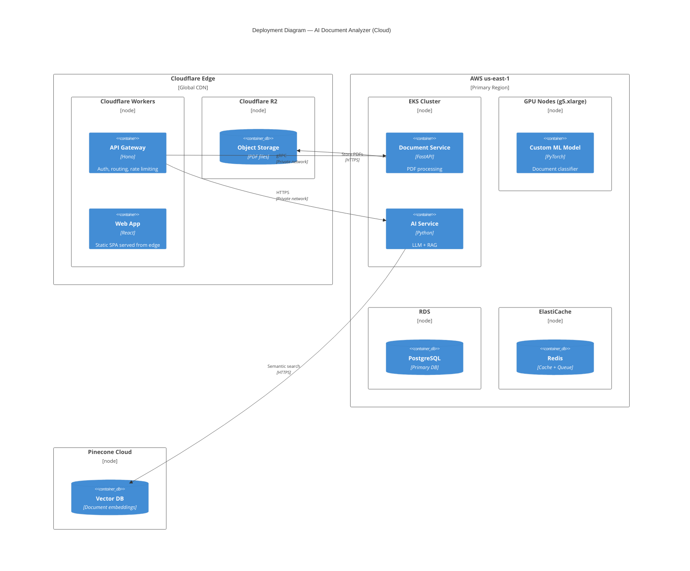
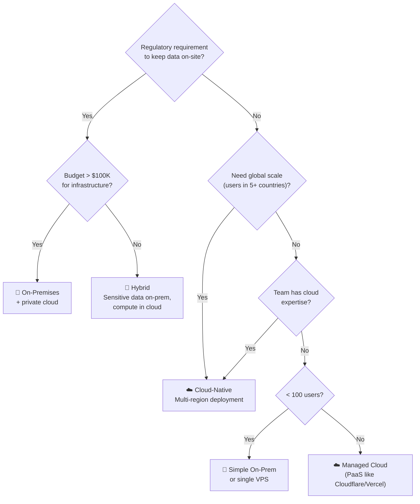
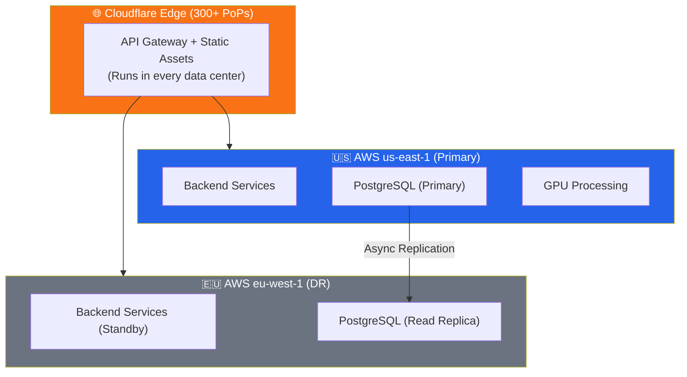

# Module 15.19: The Cloud Architect

## The Role
The Cloud Architect designs the **infrastructure topology** for the entire system. They choose cloud providers, design highly available systems, optimize costs (FinOps), and make the critical **Cloud vs On-Premises** decision.

> **Industry Reality:** Cloud Architects must balance performance, cost, compliance, and reliability. They use Infrastructure as Code (IaC) to ensure environments are reproducible. They own the C4 Deployment Diagram.

---

## Core Responsibilities

| Responsibility | Description | Output |
|---|---|---|
| Infrastructure design | Multi-region, HA, fault-tolerant | Deployment diagram |
| Cloud provider selection | AWS vs GCP vs Azure vs Cloudflare | Comparison matrix |
| Cost optimization (FinOps) | Right-sizing, reserved instances, spot | Cost report |
| Cloud vs On-Prem decision | Strategic infrastructure choice | Decision document |
| Disaster recovery | RTO/RPO targets, failover | DR plan |
| Network architecture | VPCs, subnets, load balancers, CDN | Network diagram |

---

## Scenario: AI-Powered Document Analyzer

### The Cloud Architect's Perspective

**Infrastructure strategy:**
> "We'll use a hybrid approach: Cloudflare Workers for the API gateway and static assets (global edge), AWS for GPU-intensive AI processing (us-east-1 and eu-west-1), and Cloudflare R2 for object storage (no egress fees)."

**Cost concern:**
> "Running GPU instances 24/7 costs $5,000/month. If we use spot instances with a queue-based architecture, we can cut it to $1,200/month."

---

## C4 Deployment Diagram — Cloud Architecture



---

## Cloud vs On-Premises — Strategic Decision Matrix

| Factor | ☁️ Cloud | 🏢 On-Premises | 🔀 Hybrid |
|---|---|---|---|
| **Upfront cost** | $0 (pay-as-you-go) | $50K–500K (servers) | $25K–250K |
| **Monthly cost (our scale)** | ~$3,000–8,000 | ~$1,500 (amortized) | ~$4,000 |
| **Time to deploy** | Minutes to hours | Weeks to months | Days |
| **Scalability** | Infinite (auto-scaling) | Limited by hardware | Partial |
| **Data sovereignty** | Data in provider's region | Full control | Configurable |
| **Compliance (GDPR/HIPAA)** | Depends on provider certs | Easier | Best of both |
| **Latency** | Varies by region | Ultra-low for local | Configurable |
| **Maintenance** | Provider handles hardware | You handle everything | Split |
| **Disaster recovery** | Built-in (multi-AZ) | Must build yourself | Mixed |
| **Vendor lock-in** | Risk (proprietary services) | No lock-in | Moderate |

### Decision Flowchart



> **For our Document Analyzer:** We choose **Cloud-Native** — enterprise users are global, we need auto-scaling for unpredictable PDF uploads, and we use Cloudflare's edge for low-latency API responses.

---

## FinOps — Cloud Cost Optimization

### Cost Breakdown Estimate

| Service | Monthly Cost | Optimization |
|---|---|---|
| Cloudflare Workers (API Gateway) | $5 (free tier covers most) | Edge computing = no server to manage |
| Cloudflare R2 (PDF Storage) | $15/TB stored | No egress fees (unlike S3) |
| AWS EKS (Backend services) | $500 (3 nodes) | Use spot instances for processing |
| AWS GPU (g5.xlarge) | $1,200 → $400 | Spot instances (70% savings) |
| AWS RDS (PostgreSQL) | $200 | Reserved instance (1-year) |
| Redis (ElastiCache) | $150 | Smallest instance that fits |
| Pinecone (Vector DB) | $70 (starter) | Pay per vector stored |
| OpenAI API | $500–2,000 | Cache frequent queries, use mini models |
| **Total** | **~$2,640–4,340/mo** | |

### Cost Optimization Strategies

| Strategy | Savings | How |
|---|---|---|
| Spot/preemptible instances | 60–90% | For non-critical batch jobs |
| Reserved instances | 30–60% | For always-on databases |
| Right-sizing | 20–40% | Monitor and downsize over-provisioned instances |
| Caching | 30–50% AI costs | Cache repeated LLM queries in Redis |
| Edge computing | Variable | Process at the edge, reduce origin calls |

---

## Multi-Region & High Availability



### Disaster Recovery Targets

| Metric | Target | Strategy |
|---|---|---|
| **RTO** (Recovery Time Objective) | < 30 minutes | Automated failover to eu-west-1 |
| **RPO** (Recovery Point Objective) | < 5 minutes | Async DB replication |
| **Backup frequency** | Every 6 hours | Automated database snapshots |

---

## Roundtable Questions the Cloud Architect Asks

- "DevOps Engineer — are we provisioning infrastructure using Terraform or Pulumi?"
- "Backend Engineer — do we need a Redis caching layer to reduce database load?"
- "Security Engineer — are our network policies restricting access between services?"
- "Risk Officer — which AWS regions are SOC2 compliant for our enterprise clients?"

---

## Your Deliverable: Cloud Architecture Document

```markdown
# Cloud Architecture — AI Document Analyzer

## 1. Deployment Diagram
[Mermaid C4 Deployment diagram]

## 2. Cloud vs On-Prem Decision
| Factor | Our Choice | Reasoning |
|---|---|---|

## 3. Provider Selection
| Service | Provider | Service Name | Reasoning |
|---|---|---|---|

## 4. Cost Estimate (Monthly)
| Service | Cost | Optimization Applied |
|---|---|---|

## 5. High Availability Design
| Component | Strategy | RTO | RPO |
|---|---|---|---|

## 6. Disaster Recovery Plan
- Primary region: [?]
- DR region: [?]
- Failover trigger: [?]
- Failover process: [?]
```

> **Student Action:** Design the deployment diagram and create a FinOps cost estimate. The DevOps Engineer (15.20) will provision this infrastructure using IaC.
