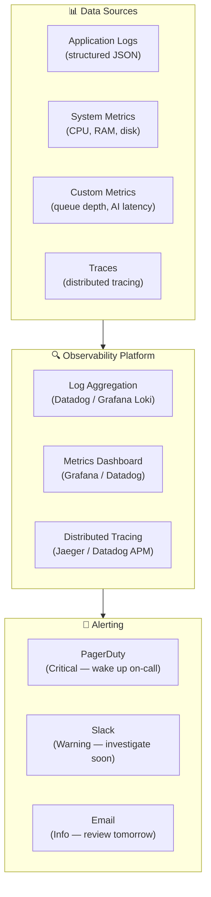
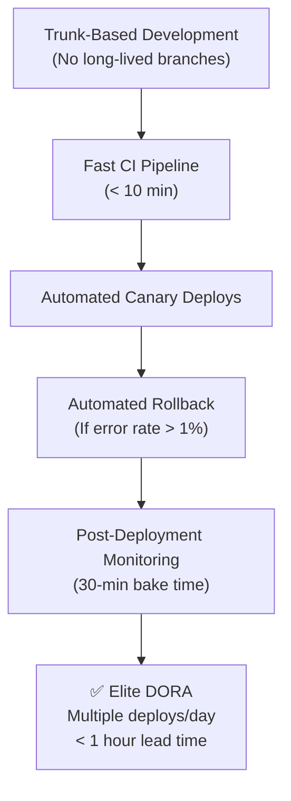

# Module 15.20: The DevOps Engineer

## The Role
The DevOps Engineer bridges **software development (Dev) and IT operations (Ops)**. They automate everything — from code commit to production deployment. They own the CI/CD pipeline, infrastructure provisioning, monitoring, and incident response.

> **Industry Reality:** DevOps Engineers are the guardians of DORA metrics. They directly influence Deployment Frequency, Lead Time, Change Failure Rate, and MTTR. A great DevOps Engineer can 10x a team's delivery speed.

---

## Core Responsibilities

| Responsibility | Description | Output |
|---|---|---|
| CI/CD pipelines | Automated build, test, deploy | Pipeline config |
| Infrastructure as Code (IaC) | Provisioning infrastructure reproducibly | Terraform / Pulumi files |
| Containerization | Docker images, Kubernetes orchestration | Dockerfiles, K8s manifests |
| Monitoring & alerting | System health, logs, traces | Dashboards + alert rules |
| Incident response | On-call, runbooks, post-mortems | Runbook library |
| DORA metrics | Track and improve delivery performance | DORA dashboard |

---

## Scenario: AI-Powered Document Analyzer

### The DevOps Engineer's Perspective

**CI/CD:**
> "Every push to `main` should automatically: run unit tests → run integration tests → build Docker images → deploy to staging. Only after QA approval do we promote to production."

**Monitoring:**
> "We need alerts for: document processing queue depth > 100, API latency P95 > 500ms, error rate > 5%, and GPU utilization > 90%."

---

## CI/CD Pipeline Architecture

```mermaid
flowchart LR
    subgraph Dev["👨‍💻 Developer"]
        A["Push to\nfeature branch"]
    end

    subgraph CI["⚙️ Continuous Integration"]
        B["Lint & Format Check"]
        C["Unit Tests"]
        D["Integration Tests"]
        E["Build Docker Images"]
        F["Security Scan\n(Trivy/Snyk)"]
    end

    subgraph CD_Staging["🟡 Deploy to Staging"]
        G["Deploy to Staging"]
        H["E2E Tests\n(Playwright)"]
        I["AI Accuracy Tests\n(Golden Dataset)"]
    end

    subgraph CD_Prod["🟢 Deploy to Production"]
        J["Manual Approval\n(or auto if all green)"]
        K["Canary Deploy\n(10% traffic)"]
        L["Monitor for 30 min"]
        M{"Errors > 1%?"}
        N["🚀 Full Rollout\n(100% traffic)"]
        O["🔙 Auto Rollback"]
    end

    A --> B --> C --> D --> E --> F
    F --> G --> H --> I
    I --> J --> K --> L --> M
    M -->|"No"| N
    M -->|"Yes"| O

    style CI fill:#1e3a5f,color:#fff
    style CD_Staging fill:#854d0e,color:#fff
    style CD_Prod fill:#166534,color:#fff
```



---

## Infrastructure as Code — Terraform Example

```hcl
# infrastructure/main.tf — Document Analyzer Infrastructure

# PostgreSQL Database
resource "aws_db_instance" "main" {
  identifier        = "doc-analyzer-db"
  engine            = "postgres"
  engine_version    = "15"
  instance_class    = "db.t3.medium"
  allocated_storage = 100
  
  db_name  = "doc_analyzer"
  username = var.db_username
  password = var.db_password  # From secrets manager
  
  multi_az               = true   # High availability
  backup_retention_period = 7     # 7 days of backups
  
  tags = {
    Environment = "production"
    Project     = "doc-analyzer"
  }
}

# Redis Cache
resource "aws_elasticache_cluster" "cache" {
  cluster_id           = "doc-analyzer-cache"
  engine               = "redis"
  node_type            = "cache.t3.micro"
  num_cache_nodes      = 1
  parameter_group_name = "default.redis7"
}

# EKS Cluster for Backend Services
resource "aws_eks_cluster" "main" {
  name     = "doc-analyzer-cluster"
  role_arn = aws_iam_role.eks.arn

  vpc_config {
    subnet_ids = var.private_subnet_ids
  }
}
```

---

## Monitoring & Alerting Architecture



### Alert Rules

| Alert | Condition | Severity | Action |
|---|---|---|---|
| API Error Rate | > 5% for 5 min | 🔴 Critical | PagerDuty → on-call engineer |
| API Latency P95 | > 500ms for 10 min | 🟡 Warning | Slack notification |
| Queue Depth | > 100 jobs for 15 min | 🟡 Warning | Auto-scale processing nodes |
| GPU Utilization | > 90% for 10 min | 🟡 Warning | Scale up GPU nodes |
| Disk Usage | > 80% | 🔴 Critical | PagerDuty + auto-expand volume |
| Database Connections | > 80% of max | 🟡 Warning | Investigate connection leaks |
| AI Model Accuracy | < 85% (from eval) | 🟠 High | Alert ML Engineer |

---

## DORA Metrics — The DevOps Dashboard

The DevOps Engineer is directly responsible for tracking and improving these:

### Current vs Target

| Metric | Current | Target | How to Improve |
|---|---|---|---|
| **Deployment Frequency** | 1x/week | Multiple/day | Automate everything, reduce manual gates |
| **Lead Time for Changes** | 4 days | < 1 day | Faster tests, smaller PRs, trunk-based dev |
| **Change Failure Rate** | 20% | < 15% | Better test coverage, canary deploys |
| **MTTR** | 2 hours | < 15 min | Automated rollback, better runbooks |

### How to Achieve Elite DORA



---

## Deployment Strategies Comparison

| Strategy | Risk | Rollback Speed | Complexity | When to Use |
|---|---|---|---|---|
| **Big Bang** | 🔴 High | ❌ Slow (full redeploy) | Low | Never in production |
| **Rolling Update** | 🟡 Medium | 🟡 Medium | Medium | Default K8s strategy |
| **Blue/Green** | 🟢 Low | ✅ Instant (switch LB) | Medium | Databases, critical services |
| **Canary** | 🟢 Low | ✅ Fast (route 0% traffic) | High | Our choice for API + AI service |
| **Feature Flags** | 🟢 Low | ✅ Instant (toggle off) | Medium | New features behind flags |

---

## Incident Response — The Runbook

```markdown
# Runbook: API Error Rate Spike

## Trigger
PagerDuty alert: "API error rate > 5% for 5 minutes"

## Diagnosis Steps
1. Check Datadog dashboard: Is it one endpoint or all?
2. Check recent deployments: Was anything deployed in the last hour?
3. Check external dependencies: Is OpenAI API down?
4. Check database: Is PostgreSQL responsive?

## Response Actions
| If... | Then... |
|---|---|
| Recent deployment caused it | Rollback immediately |
| OpenAI API is down | Switch to fallback model or queue requests |
| Database overloaded | Restart connection pool, check slow queries |
| Unknown cause | Escalate to Lead Backend Engineer |

## Post-Incident
1. Write post-mortem within 48 hours
2. Identify root cause
3. Create action items to prevent recurrence
```

---

## Roundtable Questions the DevOps Engineer Asks

- "Testing Engineer — how long does your test suite take? If > 15 min, it slows the pipeline."
- "Backend Engineer — what logs do you need in Datadog for debugging the AI integration?"
- "Cloud Architect — are we using Terraform or Pulumi for IaC?"
- "Security Engineer — do we need to add container image scanning to the CI pipeline?"

---

## Your Deliverable: CI/CD & Monitoring Document

```markdown
# DevOps Architecture — AI Document Analyzer

## 1. CI/CD Pipeline Diagram
[Mermaid flowchart: commit → test → build → deploy → monitor]

## 2. Pipeline Stages
| Stage | Tools | Duration Target | Failure Policy |
|---|---|---|---|

## 3. IaC Template (Key Resources)
[Terraform/Pulumi snippet for top 3 resources]

## 4. Monitoring & Alerts
| Alert | Condition | Severity | Action |
|---|---|---|---|

## 5. DORA Targets
| Metric | Current | Target | Improvement Plan |
|---|---|---|---|

## 6. Deployment Strategy
| Service | Strategy | Reasoning |
|---|---|---|

## 7. Incident Runbook
[Runbook for the most critical alert scenario]
```

> **Student Action:** Design the CI/CD pipeline and monitoring alerts. Define your DORA targets and how you plan to achieve "Elite" performance. The Testing Engineer's suite (15.17) must integrate into your pipeline.
