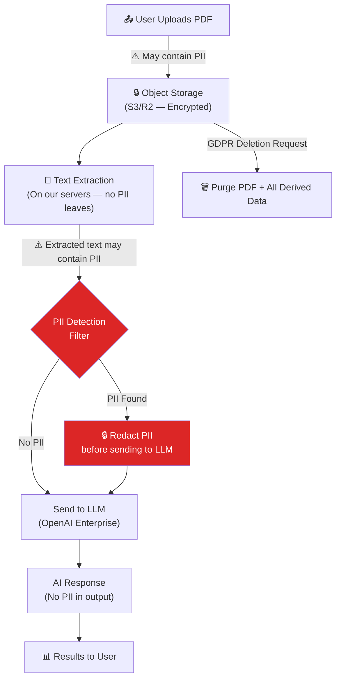

# Module 15.22: The Risk Officer

## The Role
The Risk Officer (or Compliance Officer) ensures the company's software complies with **industry regulations, laws, and internal policies**. They mitigate legal and financial risk.

> **Industry Reality:** In AI products, the Risk Officer is increasingly critical. Regulations like EU AI Act, GDPR, and CCPA impose strict requirements on how AI processes personal data. Non-compliance can result in fines up to 4% of global revenue.

---

## Core Responsibilities

| Responsibility | Description | Output |
|---|---|---|
| Regulatory compliance | GDPR, CCPA, HIPAA, SOC2 | Compliance matrix |
| Risk assessment | Identify and quantify risks | Risk register |
| Vendor risk | Evaluate third-party services | Vendor assessment |
| Data governance | Retention, deletion, access policies | Data policy |
| Audit readiness | Prepare for external audits | Audit documentation |
| AI governance | Responsible AI, bias, transparency | AI policy |

---

## Scenario: AI-Powered Document Analyzer

### The Risk Officer's Perspective

**Compliance concern:**
> "If a user uploads a PDF containing PII (Social Security Numbers, medical records), are we allowed to send that to OpenAI's servers? Under GDPR, we need a Data Processing Agreement (DPA) with every vendor that handles EU citizen data."

**Vendor risk:**
> "We must use OpenAI's Enterprise tier — the free/standard tier's ToS allows them to use our data for model training. That's a compliance violation for enterprise clients."

---

## Compliance Matrix

| Regulation | Applies To | Key Requirements | Our Status |
|---|---|---|---|
| **GDPR** | EU user data | Right to erasure, DPAs, data minimization | 🟡 In progress |
| **CCPA** | California user data | Right to know, right to delete, opt-out of sale | 🟡 In progress |
| **SOC2 Type II** | B2B SaaS (enterprise clients expect this) | Security, availability, processing integrity | ⬜ Not started |
| **HIPAA** | Healthcare data | PHI encryption, access controls, BAA | ❌ Not applicable (V1) |
| **EU AI Act** | AI systems in EU | Transparency, risk classification, human oversight | 🟡 In progress |

---

## Data Flow with PII Markers



---

## Risk Register

| # | Risk | Probability | Impact | Risk Score | Mitigation | Owner |
|---|---|---|---|---|---|---|
| R1 | User PII sent to OpenAI without consent | Medium | Critical | 🔴 High | PII detection filter + user consent checkbox | Risk Officer |
| R2 | GDPR deletion request not fully processed | Low | Critical | 🟠 High | Automated data purge pipeline (PDF + embeddings + metrics) | Data Architect |
| R3 | AI model generates biased/harmful output | Medium | High | 🟠 High | Output content filter + human review for flagged responses | AI Engineer |
| R4 | Data breach via compromised API key | Low | Critical | 🟠 High | Secrets rotation every 90 days, key scope limitations | Security Engineer |
| R5 | Non-compliance with EU AI Act | Medium | High | 🟠 High | Classify system as "limited risk", add transparency notices | Risk Officer |
| R6 | Vendor (OpenAI) data incident | Low | High | 🟡 Medium | Enterprise DPA, right to audit, backup LLM provider | Risk Officer |

---

## Vendor Risk Assessment — OpenAI

| Criteria | Assessment | Score |
|---|---|---|
| Data Processing Agreement (DPA) | ✅ Available on Enterprise tier | Pass |
| Data used for training? | ❌ Not on Enterprise tier, ✅ on free tier | Enterprise only |
| SOC2 certification | ✅ SOC2 Type II certified | Pass |
| Data residency options | 🟡 Limited (US-based) | Conditional |
| Right to audit | ✅ Available on Enterprise | Pass |
| Uptime SLA | ✅ 99.9% on Enterprise | Pass |
| **Verdict** | **Use Enterprise tier only** | ✅ Approved |

---

## GDPR Compliance Checklist

| Requirement | Implementation | Status |
|---|---|---|
| **Lawful Basis** | User consent + legitimate interest | ✅ |
| **Right to Access** | API endpoint: `GET /api/v1/users/me/data` | 🟡 To build |
| **Right to Erasure** | Automated purge: PDF + embeddings + metrics + chat | 🟡 To build |
| **Data Minimization** | Only extract needed metrics, don't store full text | ✅ |
| **Data Processing Agreement** | DPA signed with OpenAI, AWS, Pinecone | 🟡 In progress |
| **Privacy Policy** | Published and accessible | ⬜ To write |
| **Cookie Consent** | Banner with accept/reject | ⬜ To build |
| **Breach Notification** | 72-hour notification process | ⬜ To define |

---

## AI Governance Framework

| Principle | Implementation |
|---|---|
| **Transparency** | Users see "AI-generated" badge on all AI outputs |
| **Explainability** | Show source pages for each extracted metric |
| **Fairness** | Test AI for bias across document languages/formats |
| **Human Oversight** | Admin can review and override AI decisions |
| **Accountability** | Audit log of all AI interactions |
| **Data Protection** | PII redaction before sending to LLM |

---

## Roundtable Questions the Risk Officer Asks

- "Data Architect — if a user requests GDPR deletion, can we purge all their PDFs, embeddings, metrics, and chat history automatically?"
- "Product Manager — can we add a consent checkbox on the upload screen where users explicitly agree to AI processing?"
- "AI Engineer — is the AI model aware it should never output PII like SSNs or credit card numbers?"
- "Security Engineer — do we have a 72-hour breach notification process in place?"

---

## Your Deliverable: Compliance & Risk Document

```markdown
# Compliance & Risk Assessment — AI Document Analyzer

## 1. Compliance Matrix
| Regulation | Applicable? | Key Requirements | Status |
|---|---|---|---|

## 2. Data Flow Diagram (with PII markers)
[Mermaid diagram showing where PII exists in the system]

## 3. Risk Register
| Risk | Probability | Impact | Mitigation | Owner |
|---|---|---|---|---|

## 4. Vendor Risk Assessment
| Vendor | Service | DPA? | Data Training? | Verdict |
|---|---|---|---|---|

## 5. GDPR Checklist
| Requirement | Status |
|---|---|

## 6. AI Governance Policy
| Principle | Implementation |
|---|---|
```

> **Student Action:** Complete the compliance matrix and risk register. Create the PII data flow diagram. The Security Engineer's STRIDE model (15.21) feeds into your risk assessment.
