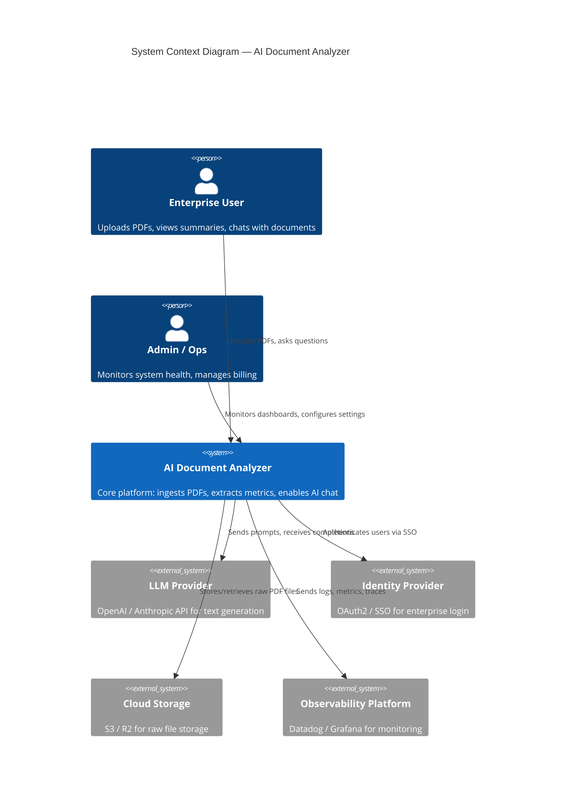
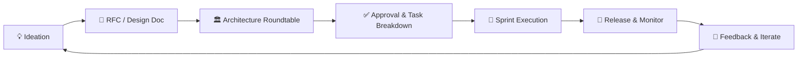
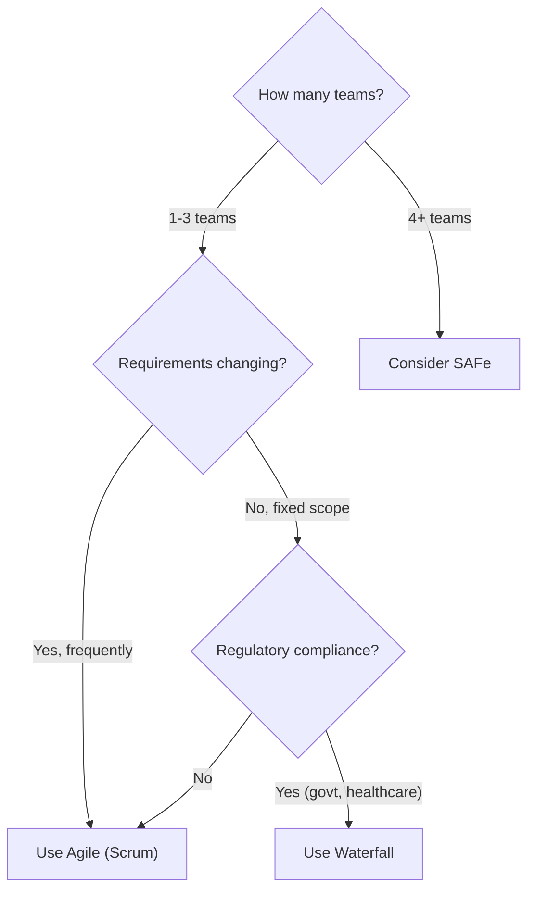
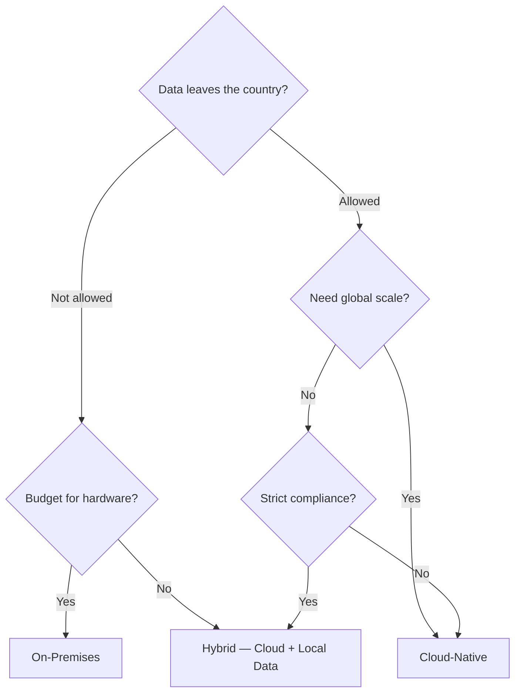

# Module 15.7: Industry Architecture Lifecycle — The Master Blueprint

## Overview
In the real world, an AI feature doesn't go straight from an idea to code. It goes through a rigorous **Architecture Lifecycle** involving multiple teams, trade-off analysis, and formal design reviews. This module teaches you the complete journey.

**Running Scenario:** Throughout modules 15.7–15.22, we simulate building an **AI-Powered Document Analyzer** — a system where enterprise users upload 100-page PDFs, and AI extracts key metrics, summarizes the document, and lets users chat with it.

---

## 1. The C4 Context Diagram — The 30,000-Foot View

Before any code is written, the team creates a **C4 Context Diagram**. This is the highest-level architecture view, showing *who* interacts with the system and *what* external systems it depends on.



> **Student Exercise:** Before reading further, try to identify: *Who are the users? What external systems does the product depend on?* This is the first question asked in every architecture roundtable.

---

## 2. The Architecture Lifecycle — From Idea to Production

Every feature in a mature company goes through these stages:



### Stage 1: Ideation & Requirements
- **Who leads:** Product Manager
- **Output:** Product Requirements Document (PRD)
- **Key question:** *"What user problem are we solving, and how do we measure success?"*

### Stage 2: RFC (Request for Comments)
- **Who leads:** Lead Engineer
- **Output:** Technical design document
- **Key question:** *"How will we build this? What are the trade-offs?"*

### Stage 3: Architecture Roundtable
- **Who participates:** All roles (PM, Engineers, Security, DevOps, etc.)
- **Output:** Approved architecture with resolved conflicts
- **Key question:** *"Does everyone agree this is the right approach?"*

### Stage 4: Task Breakdown
- **Who leads:** Scrum Master + Product Owner
- **Output:** Sprint backlog with sized user stories

### Stage 5: Sprint Execution
- **Who leads:** Engineering team
- **Output:** Working software increment

### Stage 6: Release & Monitor
- **Who leads:** DevOps + SRE
- **Output:** Production deployment with monitoring

### Stage 7: Feedback & Iterate
- **Who leads:** Product Manager + UX Designer
- **Output:** Insights for the next cycle

---

## 3. Choosing Your Methodology — Agile vs Waterfall vs SAFe

Not every project should use Agile. Here's how the industry decides:

### Decision Matrix

| Factor | Agile (Scrum/Kanban) | Waterfall | SAFe (Scaled Agile) |
|---|---|---|---|
| **Best for** | Startups, evolving requirements | Fixed-scope contracts (govt, defense) | Large enterprises with 50+ engineers |
| **Team size** | 5–9 per team | Any size | Multiple teams (50–200+) |
| **Requirements** | Changing frequently | Fixed and well-documented | Partially fixed, partially evolving |
| **Release cadence** | Every 2 weeks | Once at the end | Every 8–12 weeks (PI cycle) |
| **Risk tolerance** | High (fail fast) | Low (plan everything upfront) | Medium (structured flexibility) |
| **Customer involvement** | Continuous | At start and end only | Regular (PI Planning events) |
| **Documentation** | Light (user stories) | Heavy (SRS, SDD documents) | Medium (epics, features, stories) |

### When to Use What — Quick Guide



> **For our Document Analyzer:** We choose **Agile (Scrum)** because requirements will evolve as we learn how users interact with AI, and we have a single cross-functional team.

---

## 4. DORA Metrics — Measuring Engineering Performance

**DORA** (DevOps Research and Assessment) defines the four key metrics that predict software delivery performance. Every modern engineering team tracks these.

### The Four Metrics

| Metric | What It Measures | Elite | High | Medium | Low |
|---|---|---|---|---|---|
| **Deployment Frequency** | How often you deploy to production | On-demand (multiple/day) | Weekly to monthly | Monthly to every 6 months | Every 6+ months |
| **Lead Time for Changes** | Time from code commit to production | Less than 1 hour | 1 day to 1 week | 1 to 6 months | 6+ months |
| **Change Failure Rate** | % of deployments causing failures | 0–15% | 16–30% | 16–30% | 46–60% |
| **MTTR (Mean Time to Recovery)** | How fast you recover from failures | Less than 1 hour | Less than 1 day | 1 day to 1 week | 6+ months |

### How It Maps to Our Scenario

| Metric | Our Target | Who Owns It |
|---|---|---|
| Deployment Frequency | 2x per week | DevOps Engineer |
| Lead Time | < 2 days | Scrum Master + Backend Engineer |
| Change Failure Rate | < 15% | Testing Engineer |
| MTTR | < 1 hour | DevOps + Cloud Architect |

> **Student Exercise:** After reading the DevOps Engineer file (15.20), try to design a CI/CD pipeline that would achieve "Elite" DORA metrics.

---

## 5. Cloud vs On-Premises — The Strategic Decision

This is one of the most debated decisions in architecture. The Cloud Architect (15.19) owns this decision, but every role is affected.

### Decision Matrix

| Factor | Cloud (AWS / GCP / Cloudflare) | On-Premises | Hybrid |
|---|---|---|---|
| **Upfront Cost** | Low (pay-as-you-go) | High (buy servers) | Medium |
| **Operational Cost** | Can grow fast if unoptimized | Predictable | Mixed |
| **Scalability** | Instant (auto-scaling) | Manual (weeks to procure) | Partial |
| **Data Sovereignty** | Data may leave the country | Full control | Configurable |
| **Compliance** | Depends on provider certifications | Easier for strict regulations | Best of both |
| **Latency** | Depends on region | Ultra-low for local users | Configurable |
| **Team Expertise** | Cloud skills required | Hardware + networking skills | Both |
| **Best For** | Startups, SaaS, global apps | Banks, defense, healthcare | Large enterprises transitioning |

### When to Choose What



> **For our Document Analyzer:** We choose **Cloud-Native** (Cloudflare Workers + AWS for GPU). Enterprise users are global, we need auto-scaling, and we'll use the LLM provider's enterprise tier for data privacy.

---

## 6. Security — When Is It Non-Negotiable?

A common trap: teams say "We'll add security later." Here's the industry reality:

### Security Decision Framework

| Scenario | Security Approach | Example |
|---|---|---|
| Handling PII (names, SSN, medical data) | **Security-First (Day 1)** | Our Document Analyzer — users upload financial PDFs |
| Internal tool, no user data | **Security-Aware (Sprint 2–3)** | Admin dashboard for team metrics |
| Hackathon / prototype | **Security-Light (MVP only)** | Weekend prototype — add auth later |
| Regulated industry (healthcare, finance) | **Compliance-Driven (Before line 1 of code)** | HIPAA-compliant health app |

> **For our Document Analyzer:** We are **Security-First** because users upload sensitive financial documents. The Security Engineer (15.21) and Risk Officer (15.22) must be involved from Day 1.

---

## 7. The RFC Template — Your Deliverable

As a student, your deliverable for this module is to **write an RFC** for the AI Document Analyzer (or your own project). Use this template:

```markdown
# RFC: [Feature Name]

## Author: [Your Name]
## Date: [Date]
## Status: Draft / In Review / Approved

## 1. Problem Statement
What user problem are we solving?

## 2. Proposed Solution
High-level description of the approach.

## 3. Architecture Diagram
[Paste your C4 Context Diagram here]

## 4. Technology Choices
| Component | Choice | Reasoning |
|---|---|---|

## 5. Trade-offs & Alternatives Considered
What did we consider and reject? Why?

## 6. Security Considerations
How do we handle PII, authentication, and secrets?

## 7. Methodology
Agile / Waterfall / SAFe — and why?

## 8. Success Metrics (DORA + Business)
| Metric | Target |
|---|---|

## 9. Open Questions
What still needs to be decided?
```

> **Student Action:** Fill this template out for the AI Document Analyzer scenario. You'll reference it in every subsequent role file.

---

## What's Next?
Each subsequent file (15.8–15.22) deep-dives into a specific role. Each file includes:
- That role's **perspective** on the Document Analyzer
- **Mermaid diagrams** from their viewpoint
- A **real deliverable** they would produce
- **Industry trade-offs** they own

Start with the role that interests you most, or follow the recommended order in the README.
