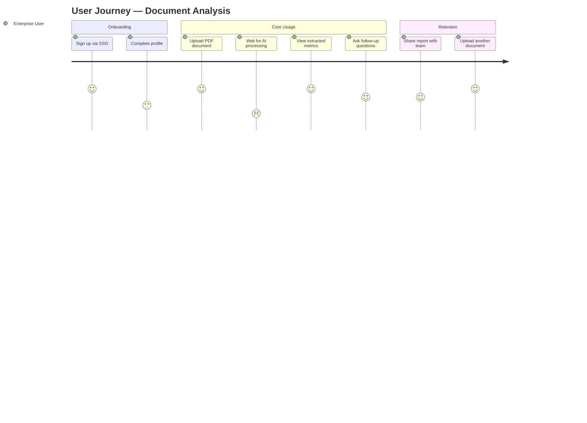

# Module 15.8: The Product Manager (PM)

## The Role
The Product Manager owns the **vision** of the product. They sit at the intersection of business, technology, and user experience. They answer the "Why" and "What" — not the "How."

> **Industry Reality:** In many AI startups, the PM also acts as the "AI Product Manager" — they must understand model capabilities and limitations to set realistic expectations with stakeholders.

---

## Core Responsibilities

| Responsibility | Description | Frequency |
|---|---|---|
| Define product vision | North-star goal for the product | Quarterly |
| Write PRDs | Product Requirements Documents for each feature | Per feature |
| Prioritize backlog | Decide what gets built next | Weekly |
| Stakeholder management | Align executives, sales, engineering | Continuous |
| Define KPIs & OKRs | Measurable success criteria | Quarterly |
| Competitive analysis | Understand market landscape | Monthly |

---

## Scenario: AI-Powered Document Analyzer

### The PM's Perspective

**Why are we building this?**
> "Enterprise users spend 5+ hours/week manually reading financial PDFs. If we automate this, we increase subscription revenue by $20/user/month and reduce churn by 15%."

**What is the MVP?**
> "V1 supports PDF and TXT only. We skip Word docs. The chat feature is V2."

**What are the success metrics?**

| OKR | Key Result | Target |
|---|---|---|
| Increase user engagement | Users upload ≥3 docs/week | 60% of active users |
| Reduce manual effort | Time-to-insight drops | From 45 min → 5 min |
| Revenue impact | Upsell to premium tier | 25% conversion rate |

---

## The Prioritization Framework — RICE Scoring

PMs don't guess what to build next. They use frameworks like **RICE**:

| Factor | Meaning | Score Range |
|---|---|---|
| **R**each | How many users does this impact? | 1–10 |
| **I**mpact | How much does it move the KPI? | 0.25 (minimal) – 3 (massive) |
| **C**onfidence | How sure are we about the estimates? | 50%–100% |
| **E**ffort | How many person-months? | 0.5–10 |

**Formula:** `RICE Score = (Reach × Impact × Confidence) / Effort`

### Applied to Our Features

| Feature | Reach | Impact | Confidence | Effort | RICE Score | Priority |
|---|---|---|---|---|---|---|
| PDF Upload + Extraction | 10 | 3 | 90% | 3 | 9.0 | 🟢 P0 |
| Chat with Document | 8 | 2 | 70% | 5 | 2.24 | 🟡 P1 |
| Word Doc Support | 4 | 1 | 90% | 2 | 1.8 | 🟠 P2 |
| Multi-language Support | 3 | 1 | 50% | 6 | 0.25 | 🔴 P3 |

---

## User Journey Map

The PM creates a user journey to visualize the experience end-to-end:



---

## Roundtable Questions the PM Asks

- "AI Engineer — if we use GPT-4 instead of a cheaper model, how much does it eat into our margins per document?"
- "Security Engineer — can we guarantee enterprise users that their uploaded documents are NOT used to train the AI model?"
- "UX Designer — what's the experience when the AI takes 10 seconds to process? Are users going to abandon?"
- "Backend Engineer — can we get a working prototype in 4 weeks for the board demo?"

---

## Your Deliverable: Product Requirements Document (PRD)

As a student acting as PM, write a PRD for the Document Analyzer using this template:

```markdown
# PRD: AI-Powered Document Analyzer

## Author: [Your Name]
## Last Updated: [Date]

## 1. Problem Statement
[What user pain point are we solving?]

## 2. Target Users
[Who is this for? Persona description.]

## 3. Success Metrics (OKRs)
| Objective | Key Result | Target |
|---|---|---|

## 4. Feature Scope — MVP
| Feature | In MVP? | Reasoning |
|---|---|---|

## 5. User Stories (High-Level)
- As a [user], I want to [action], so that [benefit].

## 6. Out of Scope (V1)
[What are we explicitly NOT building?]

## 7. Risks & Dependencies
| Risk | Impact | Mitigation |
|---|---|---|

## 8. Timeline
| Milestone | Target Date |
|---|---|
```

> **Student Action:** Complete this PRD. It will be referenced by the Product Owner (15.9) to create user stories.
