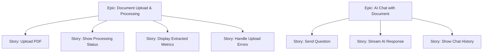

# Module 15.9: The Product Owner (PO)

## The Role
While the Product Manager looks at the **macro-level vision**, the Product Owner works at the **micro-level execution**. They translate the PM's PRD into actionable, sized engineering tasks. The PO is the single source of truth for "What does the team build this sprint?"

> **Industry Reality:** In many companies, the PM and PO are the same person. In larger enterprises, they are separate roles — the PM talks to executives, the PO talks to engineers.

---

## Core Responsibilities

| Responsibility | Description | Frequency |
|---|---|---|
| Manage the Product Backlog | Single prioritized list of all work | Continuous |
| Write User Stories | Detailed stories with acceptance criteria | Per feature |
| Groom the backlog | Refine, size, and prioritize stories | Weekly |
| Sprint Planning | Decide what enters each sprint | Every 2 weeks |
| Accept/reject work | Verify stories meet "Definition of Done" | End of sprint |

---

## Scenario: AI-Powered Document Analyzer

### The PO Breaks Down the PM's Vision into Stories

The PM said: *"Users should be able to upload a PDF and see extracted financial metrics."*

The PO translates this into **epics → user stories → acceptance criteria:**



### Example User Story with Acceptance Criteria

```markdown
## User Story: Upload PDF Document

**As an** enterprise user,
**I want to** upload a PDF document (up to 50MB),
**So that** the AI can analyze and extract key financial metrics.

### Acceptance Criteria
- [ ] System accepts PDF files up to 50MB
- [ ] System rejects non-PDF files with a clear error message
- [ ] Upload progress bar is visible during upload
- [ ] After upload, system shows "Processing..." status
- [ ] If the PDF is password-protected, show error: "Please upload an unprotected PDF"
- [ ] Upload completes within 5 seconds for files under 10MB

### Definition of Done
- [ ] Unit tests pass
- [ ] Code reviewed by 1 peer
- [ ] Deployed to staging
- [ ] QA verified on staging
- [ ] Product Owner accepted the story
```

---

## Story Mapping — Visualizing the Whole Product

A **Story Map** organizes user stories by activity (horizontal) and priority (vertical):

| | Upload Flow | Processing Flow | Results Flow | Chat Flow |
|---|---|---|---|---|
| **Must Have (MVP)** | Upload PDF | Extract text from PDF | Show key metrics table | — |
| **Should Have** | Drag-and-drop upload | Show progress bar | Export metrics as CSV | Ask a question |
| **Nice to Have** | Upload Word docs | Multi-language OCR | Visual charts | Chat history |

---

## Backlog Grooming Checklist

Before a story enters a sprint, the PO verifies:

- [ ] **Clear:** Is the story unambiguous? Could two engineers interpret it differently?
- [ ] **Testable:** Can QA write a test for every acceptance criterion?
- [ ] **Sized:** Has the team estimated it (story points or T-shirt sizes)?
- [ ] **Independent:** Can this story be built without waiting for another story?
- [ ] **Valuable:** Does this story deliver user value on its own?
- [ ] **Negotiable:** Is there room for the engineer to choose *how* to implement it?

> This is the **INVEST** criteria — a widely used industry standard.

---

## Roundtable Questions the PO Asks

- "Backend team — does this user story have enough detail for you to size the effort?"
- "UX Designer — do we have the error state designs for when an upload fails?"
- "Testing Engineer — can you write automated tests from these acceptance criteria?"
- "Scrum Master — should we split this story? It feels like it's too big for one sprint."

---

## Your Deliverable: User Story Backlog

As a student acting as PO, create a backlog of 5–8 user stories for the Document Analyzer MVP:

```markdown
# Product Backlog — AI Document Analyzer

## Sprint 1 Stories

### Story 1: [Title]
- **As a** [user type]
- **I want to** [action]
- **So that** [benefit]
- **Acceptance Criteria:**
  - [ ] Criterion 1
  - [ ] Criterion 2
- **Story Points:** [1/2/3/5/8/13]
- **Priority:** P0 / P1 / P2

### Story 2: [Title]
...
```

> **Student Action:** Write at least 5 user stories with full acceptance criteria. The Testing Engineer (15.17) will use these to create their test plan.
