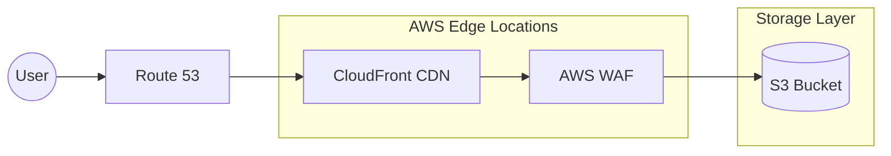

# Hands-on 8.3: Storing User Avatars with AWS S3

## Goal
Implement a robust image storage system using **Amazon S3**. You will move from storing simple URL strings to handling actual file uploads, storing them in the cloud, and saving the persistent link in your database.

## Architecture Flow
1. **Frontend:** User selects a local image file and clicks "Upload".
2. **Backend:** Receives the multipart file, generates a unique filename, and uploads it to an AWS S3 Bucket.
3. **Storage:** S3 returns a permanent Public URL for the file.
4. **Database:** Save the S3 URL in the `users.avatar_url` column.
5. **UI Display:** Frontend uses the saved URL to render the avatar.

## Tasks

### 1) AWS S3 Setup (Manual)
- Create an S3 Bucket (e.g., `my-vibe-app-avatars`).
- Disable "Block all public access" (for learning purposes) or set up a Bucket Policy for public read access.
- Create an IAM User with `AmazonS3FullAccess` and save the **Access Key ID** and **Secret Access Key**.

### 2) Backend Implementation (Node.js/Express Example)
You will need the `@aws-sdk/client-s3` and `multer` libraries.

```javascript
// Example Endpoint logic
router.post('/api/user/avatar', upload.single('avatar'), async (req, res) => {
  const file = req.file;
  
  // 1. Upload to S3
  const s3Params = {
    Bucket: process.env.S3_BUCKET_NAME,
    Key: `avatars/${Date.now()}-${file.originalname}`,
    Body: file.buffer,
    ContentType: file.mimetype,
    ACL: 'public-read'
  };

  const command = new PutObjectCommand(s3Params);
  await s3Client.send(command);

  const fileUrl = `https://${s3Params.Bucket}.s3.${process.env.AWS_REGION}.amazonaws.com/${s3Params.Key}`;

  // 2. Update Database
  await db.user.update({ where: { id: req.user.id }, data: { avatarUrl: fileUrl } });

  res.json({ success: true, url: fileUrl });
});
```

### 3) Frontend "User Profile" Page
Build a modern profile settings page:
- **File Input:** Use `<input type="file" accept="image/*" />`.
- **Preview:** Show the selected image locally before uploading.
- **Progress Bar:** (Optional) Show upload progress.
- **Success State:** Trigger a toast message and update the "Current Avatar" display.

## Expected Outcome
- Users can upload real photos from their devices.
- Images persist in S3 even if the backend server restarts.
- The UI instantly reflects the new profile picture.

---

## 🌟 Bonus: Enterprise Architecture (Scaling & Security)

In a real-world production environment, you never expose your S3 bucket directly to the public. Instead, you use a layered approach for security, speed, and cost-efficiency.

### Mermaid Diagram: Production Flow



### Key Components Explained:
1.  **Route 53:** Your DNS provider (e.g., `media.myapp.com`). It points users to the nearest CloudFront location.
2.  **CloudFront (CDN):** Caches your images globally. This makes images load instantly for users in any country and reduces S3 data transfer costs.
3.  **AWS WAF (Web Application Firewall):** Protects your images from bots, scrapers, and DDoS attacks.
4.  **S3 Bucket:** The source of truth where files are stored privately. CloudFront accesses it using **OAC (Origin Access Control)**.
